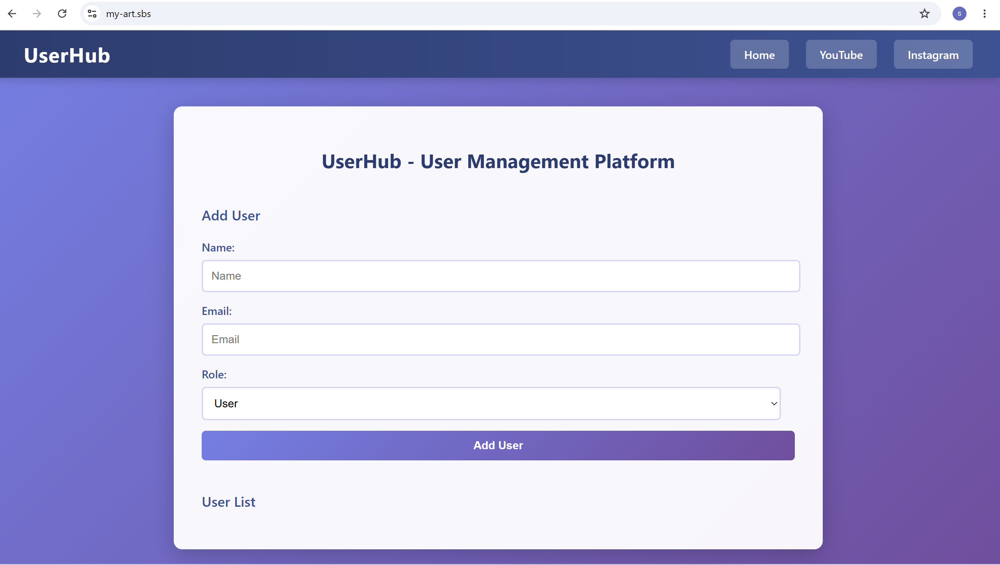

# Runbook — EKS QA Cluster, DockerHub, and SonarQube

This runbook documents the steps to create the EKS cluster, prepare DockerHub, run the repository scripts, and set up SonarQube.

Prerequisites
- `aws`, `eksctl`, `kubectl`, `git`, and `docker` installed and configured in your local environment.
- AWS account ID, AWS region, and desired EKS cluster name.
- Docker Hub account (create a repo named `nodejs-app` in your Docker Hub account).

High-level steps
1. Create the EKS cluster (example using `eksctl`):

```bash
eksctl create cluster \
  --name qa-cluster \
  --region ap-south-1 \
  --version 1.33 \
  --nodegroup-name qa-workers \
  --node-type m7i-flex.large \
  --nodes 2 \
  --nodes-min 2 \
  --nodes-max 8 \
  --managed
```

2. Wait for the cluster to be provisioned. Then update kubeconfig:

```bash
aws eks update-kubeconfig --region ap-south-1 --name qa-cluster
```

3. Create a Docker Hub personal access token (Settings → Account → Security → Personal Access Tokens) and note it.

4. Clone the repo and run scripts:

Before running the scripts

- Edit `scripts/github-oidc.sh` and set the following variables at the top of the file: `ACCOUNT_ID`, `REGION`, `CLUSTER_NAME`, `DOCKERHUB_USERNAME`, `DOCKERHUB_PASSWORD`, and (optionally) `DOCKERHUB_EMAIL`.
- Do NOT commit secrets to the repository. Prefer using a Docker Hub personal access token and GitHub repository secrets (`DOCKERHUB_TOKEN`) for CI. If you must run scripts locally, set the variables only on your machine.

Notes on `scripts/github-oidc.sh`
- The script previously contained hardcoded Docker Hub credentials. They have been replaced with the variables:
  - `DOCKERHUB_USERNAME`
  - `DOCKERHUB_PASSWORD`
  - `DOCKERHUB_EMAIL` (optional)
- Edit `scripts/github-oidc.sh` and set these variables before running.

```bash
git clone https://github.com/imagefactory-web/3-tier-user-platform-project.git
cd 3-tier-user-platform-project/scripts

# Edit scripts/github-oidc.sh and set the following variables at top of file:
# ACCOUNT_ID, REGION, CLUSTER_NAME, DOCKERHUB_USERNAME, DOCKERHUB_PASSWORD, DOCKERHUB_EMAIL

# Then run in sequence:
./github-oidc.sh
./aws-alb-controller.sh
./mysql-and-aws-secrets-setup.sh
```

Repository secrets (to add in GitHub repository Settings → Secrets → Actions)
- `AWS_ROLE_TO_ASSUME` — e.g. `arn:aws:iam::<<ACCOUNT_ID>>:role/GitHubActionsEKSDeployRoleQA`
- `DOCKERHUB_TOKEN` — Docker Hub personal access token
- `SONAR_HOST_URL` — e.g. `http://<SONAR_PUBLIC_IP>:9000/`
- `SONAR_TOKEN` — SonarQube token

Repository variables (Settings → Variables)
- `DOCKERHUB_REPO` — e.g. `your-handle/nodejs-app`
- `DOCKERHUB_USERNAME`
- `EKS_CLUSTER_NAME`

SonarQube setup (on an EC2 instance)
1. Launch an EC2 instance (Ubuntu) and SSH into it.
2. Install Docker and start it:

```bash
sudo install -m 0755 -d /etc/apt/keyrings
curl -fsSL https://download.docker.com/linux/ubuntu/gpg | sudo tee /etc/apt/keyrings/docker.asc
sudo chmod a+r /etc/apt/keyrings/docker.asc
echo "deb [arch=$(dpkg --print-architecture) signed-by=/etc/apt/keyrings/docker.asc] https://download.docker.com/linux/ubuntu $(. /etc/os-release && echo \"$VERSION_CODENAME\") stable" | sudo tee /etc/apt/sources.list.d/docker.list > /dev/null
sudo apt update -y
sudo apt install -y docker-ce docker-ce-cli containerd.io docker-buildx-plugin docker-compose-plugin
sudo systemctl enable --now docker
sudo usermod -aG docker $USER
sudo chmod 666 /var/run/docker.sock
```

3. Run SonarQube container:

```bash
docker pull sonarqube:lts-community
docker rm -f sonarqube || true
docker run -d --name sonarqube -p 9000:9000 --restart unless-stopped sonarqube:lts-community
```

4. After SonarQube starts (give it ~30–60s), get the EC2 public IP and access:
   `http://<EC2_PUBLIC_IP>:9000/` (default credentials: `admin` / `admin`).

Create a Sonar token and add it to repository secrets as `SONAR_TOKEN`.

Optional: After running the scripts, verify Kubernetes resources in the `qa` namespace:

```bash
kubectl get nodes
kubectl get pods -n qa
kubectl get svc -n qa
```

DNS, Certificate, and Load Balancer Setup

This section covers Route53 DNS setup, ACM certificate provisioning, and ALB configuration.

### 1. Create Route53 Hosted Zone

1. Go to **AWS Route53** → **Hosted zones** → **Create hosted zone**.
2. Enter your domain name (e.g., `my-art.sbs`) and click **Create hosted zone**.
3. You will see two records created (NS and SOA). Copy the **nameserver values** (NS records).
4. Go to your domain registrar (e.g., GoDaddy, Namecheap) and update the nameservers with the values from Route53.
   - This typically takes 24–48 hours to propagate globally.

### 2. Request a Public Certificate in Certificate Manager

1. Go to **AWS Certificate Manager** → **Request a certificate** → **Request a public certificate**.
2. Enter your domain name (e.g., `my-art.sbs`).
3. Click **Add another name to this certificate** and enter the wildcard domain (e.g., `*.my-art.sbs`).
4. Click **Request**.
   - You will see two domains in **Pending validation** status.
5. Click **Create records in Route53** to auto-validate the certificate.
6. Click the **Create records** button again to confirm.
7. Wait for the status to change from **Pending validation** to **Issued** (usually 5–10 minutes).
8. Copy the **certificate ARN** (e.g., `arn:aws:acm:ap-south-1:123456789:certificate/xxxx`).

### 3. Update Ingress with Certificate and Domain

1. Open `k8-manifests/app-ingress.yaml`.
2. Update **line 11** with your certificate ARN:
   ```yaml
   alb.ingress.kubernetes.io/certificate-arn: arn:aws:acm:ap-south-1:YOUR_ACCOUNT_ID:certificate/YOUR_CERT_ID
   ```
3. Update **line 13** with your domain:
   ```yaml
   - host: my-art.sbs
   ```

### 4. Update Deployment with Repository Image

1. Open `k8-manifests/app-deployment.yaml`.
2. Update **line 20** with your Docker Hub repository URL:
   ```yaml
   image: DOCKERHUB_USERNAME/nodejs-app:LATEST_TAG
   ```
   - Example: `image: your-handle/nodejs-app:latest`

### 5. Trigger the CI/CD Pipeline

1. Make a small edit to `.github/workflows/cicd.yml` (e.g., add a comment or update a trigger condition).
2. Commit and push the change:
   ```bash
   git add .github/workflows/cicd.yml
   git commit -m "trigger: update cicd workflow"
   git push origin main
   ```
3. The pipeline will start automatically. Monitor it on the **GitHub Actions** tab.
4. Once the pipeline completes, the Docker image will be built and pushed to Docker Hub, and the deployment will be updated in EKS.

### 6. Create Route53 Alias Record for Load Balancer

1. After the ingress controller provisions the ALB (check with `kubectl get ingress -n qa`), get the ALB DNS name:
   ```bash
   kubectl get ingress app-ingress -n qa -o jsonpath='{.status.loadBalancer.ingress[0].hostname}'
   ```
   - Example output: `k8s-qa-appingre-695a4c242a-52333991.ap-south-1.elb.amazonaws.com`

2. Go to **Route53** → **Your Hosted Zone** → **Create record**.
3. In the **Record name** field, leave blank or enter a subdomain (e.g., `www` or `api`).
4. Under **Record type**, select **A – IPv4 address**.
5. Enable **Alias** (toggle on).
6. Under **Route traffic to**, select **Alias to Application and Classic Load Balancer**.
7. Choose your **Region** (e.g., `ap-south-1`).
8. Select the **Load Balancer** from the dropdown (it should match the ALB DNS you copied above).
9. Click **Create records**.

You should now be able to access your application at `https://my-art.sbs` (or your domain).

Verification and Next Steps

After completing all setup steps, verify the following:

1. **Check ingress status:**
   ```bash
   kubectl get ingress app-ingress -n qa
   ```
   - Should show `CLASS: alb`, `HOSTS: my-art.sbs`, and `ADDRESS: <ALB_DNS>`.

2. **Check deployment pods:**
   ```bash
   kubectl get pods -n qa
   ```
   - All pods should be `Running` and `Ready`.

3. **Check services:**
   ```bash
   kubectl get svc -n qa
   ```
   - NodePort and ALB service should be active.

4. **Test the application:**
   ```bash
   # Wait for DNS propagation
   curl -k https://my-art.sbs
   ```

5. **Check SonarQube analysis:**
   - Go to `http://<SONAR_IP>:9000/` and verify scans are running on each commit.

6. **Monitor CI/CD pipeline:**
   - Go to **GitHub Actions** and confirm workflow runs complete successfully on each push to `main` or `qa` branches.

Common Next Steps
- Set up auto-scaling policies for EKS nodes and pods.
- Enable AWS WAF on the ALB for additional security.
- Configure CloudWatch alarms for monitoring pod and node health.
- Set up backups for the MySQL database.
- Add additional environments (dev, staging, prod) with separate hosted zones and certificates.

## Application Access

After the setup is complete, confirm the application UI and the access URL below.



- **Access URL:** https://my-art.sbs (replace with your domain or the ALB DNS name)
- **Alternative (ALB DNS):** `https://<ALB_DNS>` — retrieve with:

```bash
kubectl get ingress app-ingress -n qa -o jsonpath='{.status.loadBalancer.ingress[0].hostname}'
```

Replace the placeholder domain above with your actual hosted domain once DNS propagation completes.


